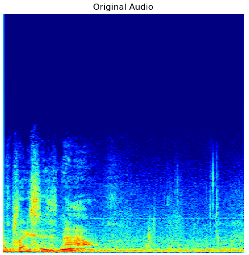

# 🎙️ Spoofed Audio Detection in the Age of Misinformation

With the rise of deepfake technology, synthetic audio can now mimic the voices of real individuals — including public figures — with alarming accuracy. This project builds a deep learning model to detect spoofed (AI-generated) political audio and protect public trust in digital communications.

---

## What is Spoofed Audio?

Spoofed audio (also known as deepfake audio) refers to artificially generated speech designed to sound like a real person. It can be used to impersonate political leaders, influence voters, manipulate markets, or deceive authentication systems.

---

## Project Overview

This system detects deepfake political speech using **spectrogram-based analysis** and a hybrid **CNN-LSTM model**. The model is trained to distinguish between:
- ✅ Real speeches from President Joe Biden
- ❌ Synthetic clones created using ElevenLabs API

## 📈 Spectrogram Analysis: Real vs Spoofed Audio

Below is a time–frequency comparison between authentic speech and AI-generated synthetic speech.

| Original (Real) | Spoofed (Deepfake) |
|----------------|-------------------|
|  |  |

### Technical Observations

### ✅ Real Speech (Authentic)
Real human speech exhibits:

- Natural micro-variations in pitch and formants  
- Irregular harmonic energy distribution  
- Background noise and breath artifacts  
- Non-stationary frequency transitions  

These characteristics produce:
- diffuse textures  
- uneven energy bands  
- less periodic structure  

This randomness reflects the **biomechanical nature of human vocal cords and airflow**.

---

### ❌ Spoofed Speech (Synthetic)
Synthetic speech shows:

- Over-smooth harmonic structures  
- Repetitive vertical patterns  
- More stationary frequency bands  
- Reduced micro-noise and breath artifacts  

These create:
- sharper vertical streaks  
- overly consistent spectral energy  
- artificial regularity  

This occurs because neural TTS/vocoder models synthesize speech from **learned spectral templates**, not physical vocal mechanics.

---

### Why this matters for detection

The CNN extracts spatial frequency patterns while the LSTM captures temporal dynamics.

The model learns:

- spectral smoothness differences
- harmonic regularity
- temporal consistency artifacts

These subtle cues allow reliable separation between real and spoofed audio, leading to high detection accuracy.

---

## Dataset Preparation

The dataset includes ~90 minutes of audio:
- 🗣️ 50 minutes of real speeches extracted from verified YouTube sources using `yt-dlp`
- 🧠 40 minutes of fake audio generated with ElevenLabs' voice cloning API

**Processing Pipeline:**
1. **Chunking**: Each audio clip is split into 3-second segments
2. **Spectrograms**: STFT is applied to convert audio into high-resolution 256×256 images
3. **Splitting**:
   - Training: 70%
   - Validation: 20%
   - Testing: 10%

---

## Model Architecture

We use a **CNN-LSTM hybrid** architecture:
- 🔹 4 CNN blocks: extract spatial patterns from spectrograms
- 🔸 LSTM layer: captures temporal dependencies in frequency dynamics
- 🔚 Sigmoid layer: binary classification (original / spoofed)

**Training Parameters:**
- Optimizer: RMSprop
- Loss: Binary crossentropy
- Epochs: 100
- Batch size: 8
- Image size: 256x256

---

## 📊 Results

| Metric     | Score     |
|------------|-----------|
| Accuracy   | 99.35%    |
| Precision  | 1.0000    |
| Recall     | 0.9870    |
| F1-Score   | 0.9935    |

Confusion matrix showed only 1 misclassified case out of 154 test samples.

---

## Generalization
The trained model also performed consistently well on new unseen samples, indicating strong real-world applicability.

---

## License
This project is intended for educational and research use only.
